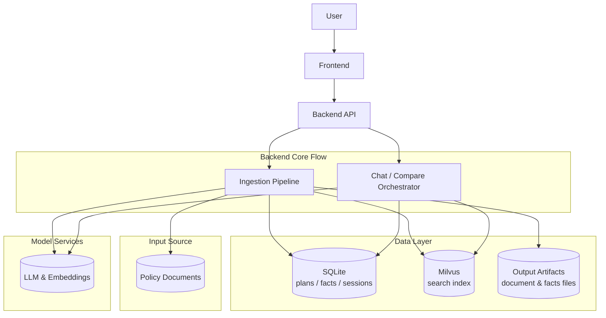
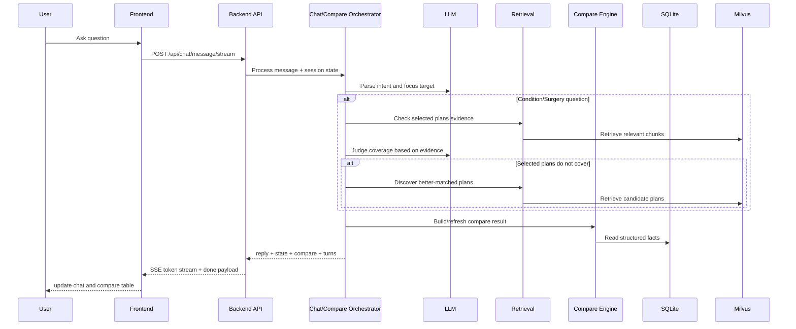
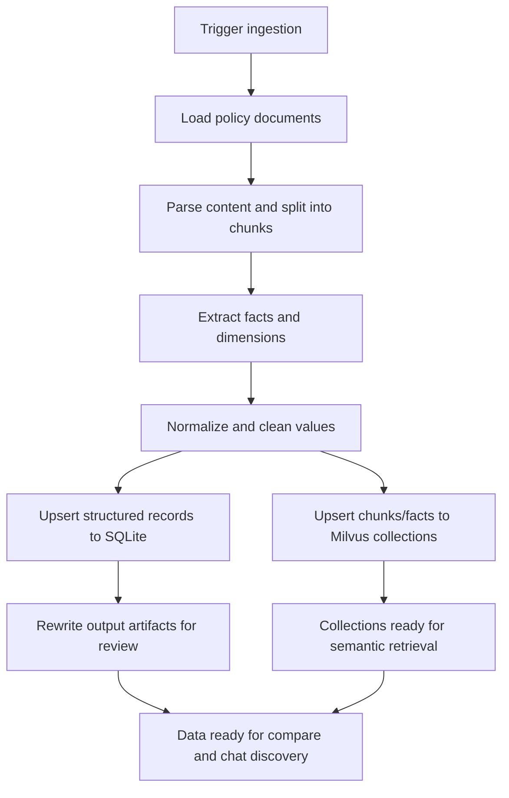
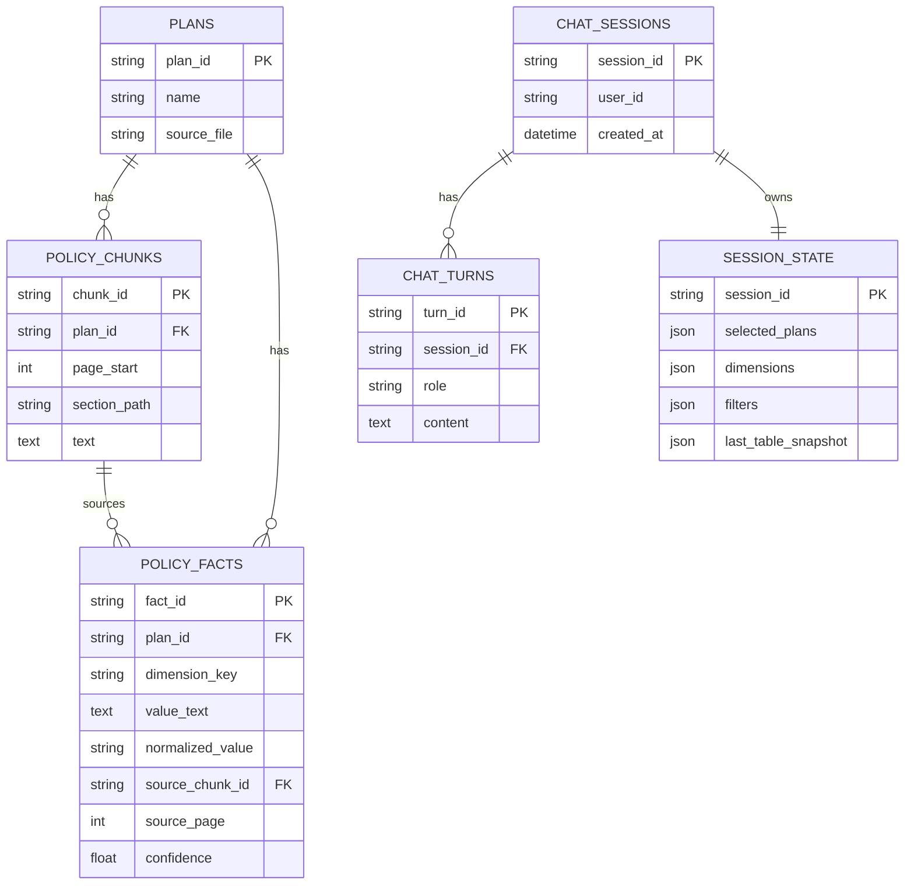

# Insurance Comparison Architecture

This document describes the current project architecture and the main runtime/data pipelines.

## 1. System Context

System context responsibilities:

- Ingestion pipeline: read policy docs, extract structured facts, write data stores, and refresh retrieval index.
- Chat/compare orchestrator: process user intent, keep session state, run compare, and trigger plan discovery when needed.
- Data layer: SQLite is the source of truth for table/state; Milvus is retrieval acceleration for semantic discovery/evidence.

## 2. Chat + Auto Discover Runtime Flow

## 3. Ingestion Pipeline

## 4. Core SQLite Data Model

## 5. Frontend Composition (Current)

- `App.jsx`: page shell and global state (`selectedPlanIds`, `selectedDimensions`, `compareData`, `sessionId`, `chatTurns`).
- `PlanDimensionPanel.jsx`: choose plans and dimensions.
- `CompareTable.jsx`: render comparison rows and differences.
- `ChatPanel.jsx`: send message, render streaming/non-stream responses.
- `api.js`: REST + SSE integration with backend.
